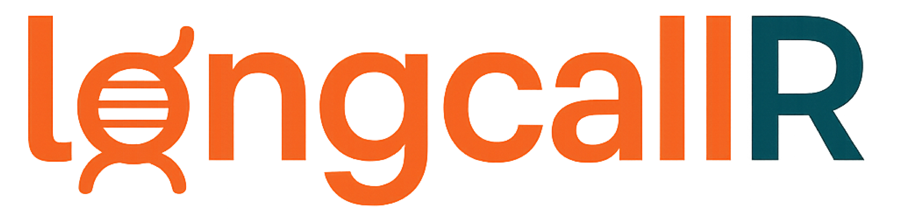

<p align="center">
    
</p>

<p align="center">
  <a href="https://crates.io/crates/longcallR">
    
  </a>
  <a href="https://opensource.org/licenses/MIT">
    
  </a>
  <a href="https://crates.io/crates/longcallR">
    
  </a>
  <a href="https://github.com/huangnengCSU/longcallR/releases">
    
  </a>
  <a href="https://github.com/huangnengCSU/longcallR">
    
  </a>
</p>

## Getting Started
```sh
# download and build longcallR
git clone https://github.com/huangnengCSU/longcallR.git
cd longcallR
cargo build --release

# call small variants from Nanopore cDNA reads
./longcallR -b input.bam -f ref.fa -o output -t 8 -p ont-cdna

# call small variants from Nanopore dRNA reads
./longcallR -b input.bam -f ref.fa -o output -t 8 -p ont-drna

# call small variants from PacBio iso-seq reads
./longcallR -b input.bam -f ref.fa -o output -t 8 -p hifi-isoseq

# call small variants from PacBio mas-seq reads
./longcallR -b input.bam -f ref.fa -o output -t 8 -p hifi-masseq
```

## Table of Contents
- [Introduction](#introduction)
- [Compiling](#compiling)
- [Usage](#usage)
- [Demo](#demo)
- [License](#license)

## Introduction
LongcallR is a small variant caller for single molecule long-read RNA-seq data. LongcallR supports Nanopore cDNA sequecing and dRNA sequencing, PacBio Iso-Seq and MAS-Seq.

## Compiling

LongcallR is written in [Rust](https://www.rust-lang.org) and uses [Cargo](https://doc.rust-lang.org/cargo/getting-started/installation.html) to build as follows:
```
git clone https://github.com/huangnengCSU/longcallR.git
cd longcallR
cargo build --release
```
Alternatively, install directly from crates.io:
```
cargo install longcallR
```

## Usage

General usage
```
./longcallR \
--bam-path input.bam \                  ## The alignment bam file
--ref-path ref.fa \                     ## The reference file must be indexed.
--preset ${PRESET} \                    ## option: {ont-cdna, ont-drna, hifi-isoseq, hifi-masseq}
--output ${OUTPUT_DIR}/${PREFIX}        ## output path and prefix of output files
```

## Demo
```
./longcallR -b demo/demo.bam -f demo/chr20.fa -o demo/test -t 8 -p hifi-masseq
```

## License
MIT License

Copyright (c) 2024 Dana-Farber Cancer Institute.

Permission is hereby granted, free of charge, to any person obtaining a copy
of this software and associated documentation files (the "Software"), to deal
in the Software without restriction, including without limitation the rights
to use, copy, modify, merge, publish, distribute, sublicense, and/or sell
copies of the Software, and to permit persons to whom the Software is
furnished to do so, subject to the following conditions:

The above copyright notice and this permission notice shall be included in all
copies or substantial portions of the Software.

THE SOFTWARE IS PROVIDED "AS IS", WITHOUT WARRANTY OF ANY KIND, EXPRESS OR
IMPLIED, INCLUDING BUT NOT LIMITED TO THE WARRANTIES OF MERCHANTABILITY,
FITNESS FOR A PARTICULAR PURPOSE AND NONINFRINGEMENT. IN NO EVENT SHALL THE
AUTHORS OR COPYRIGHT HOLDERS BE LIABLE FOR ANY CLAIM, DAMAGES OR OTHER
LIABILITY, WHETHER IN AN ACTION OF CONTRACT, TORT OR OTHERWISE, ARISING FROM,
OUT OF OR IN CONNECTION WITH THE SOFTWARE OR THE USE OR OTHER DEALINGS IN THE
SOFTWARE.